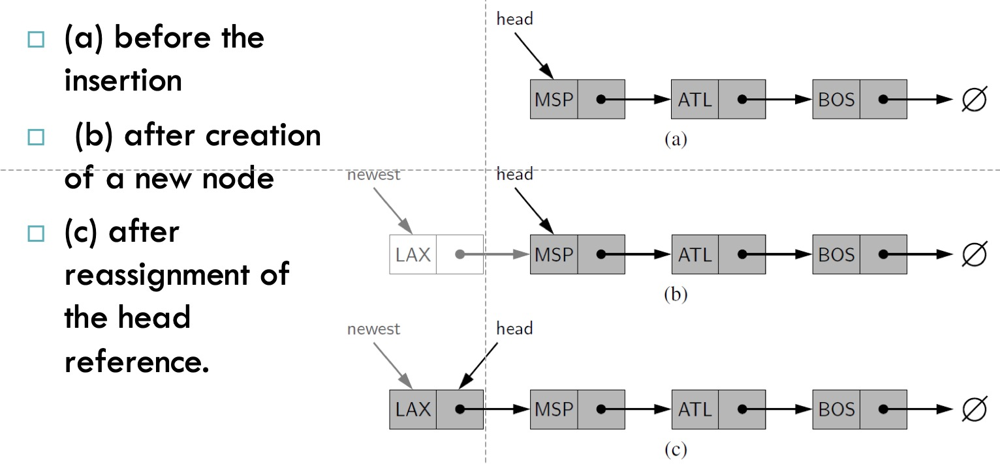
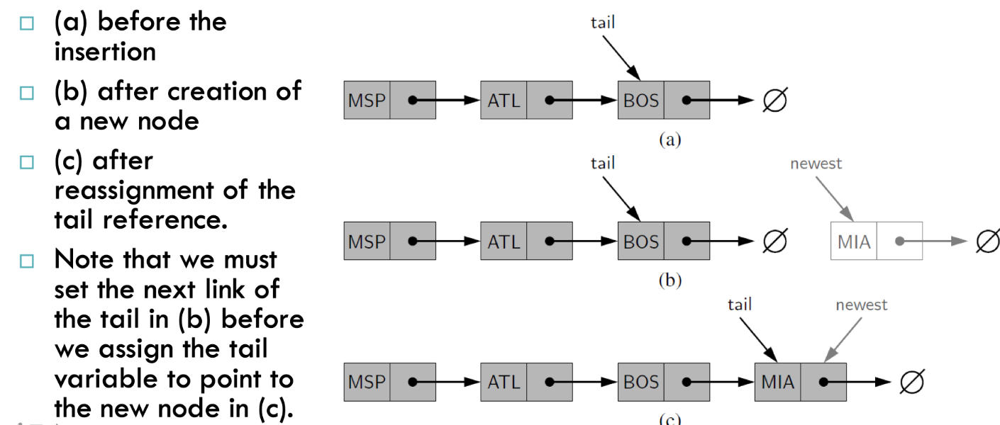
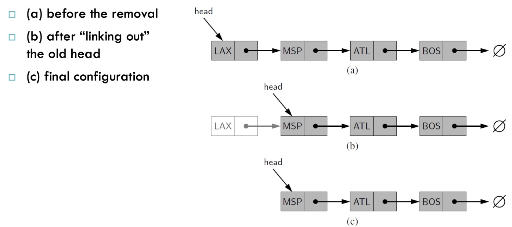

# Singly Linked Lists

* A **singly linked list**, in its simplest form, is a collection of nodes that collectively form a linear sequence.
* Each node stores a reference to an object that is an element of the sequence, as well as a reference to the next node of the list.

* The list instance maintains a member named **head** that identifies the first node of the list.
* In some applications another member named **tail** that identifies the last node of the list.

* If we start going through the notes and going through the connections of the pointers that will be known as **traversing the linked list**

* Because the next reference of a node can be viewed as a link or pointer to another node, the process of traversing a list is also known as **link hopping** or **pointer hopping**.

#### Inserting an element at the head of a singly linked list.

* An important property of a linked list is that it does not have a predetermined fixed size
* It uses space proportionally to its current number of elements.
* To insert a new element at the head of the list:
    * We create a new node
    * Set its element to the new element
    * set its next link to refer to the current head
    * then set the list’s head to point to the new node.

#### Inserting an Element at the Tail of a Singly Linked List

* We can also easily insert an element at the tail of the list, provided we keep a reference to the tail node
    * Create a new node
    * Assign its next reference to None
    * Set the next reference of the tail to point to this new node
    * Then update the tail reference itself to this new node.

    

#### Removing an Element from a Singly Linked List

* Removing an element from the head of a singly linked list is essentially the reverse operation of inserting a new element at the head.

* We cannot easily delete the last node of a singly linked list.
* Even if we maintain a tail reference directly to the last node of the list, we must be able to access the node before the last node in order to remove the last node.
* But we cannot reach the node before the tail by following next links from the tail.
* If we want to support such an operation efficiently, we will need to make our list **doubly linked**
