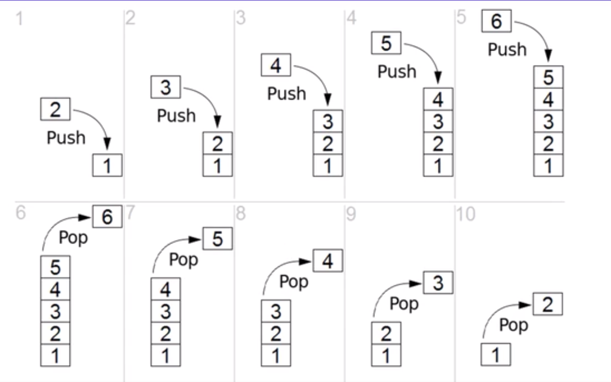
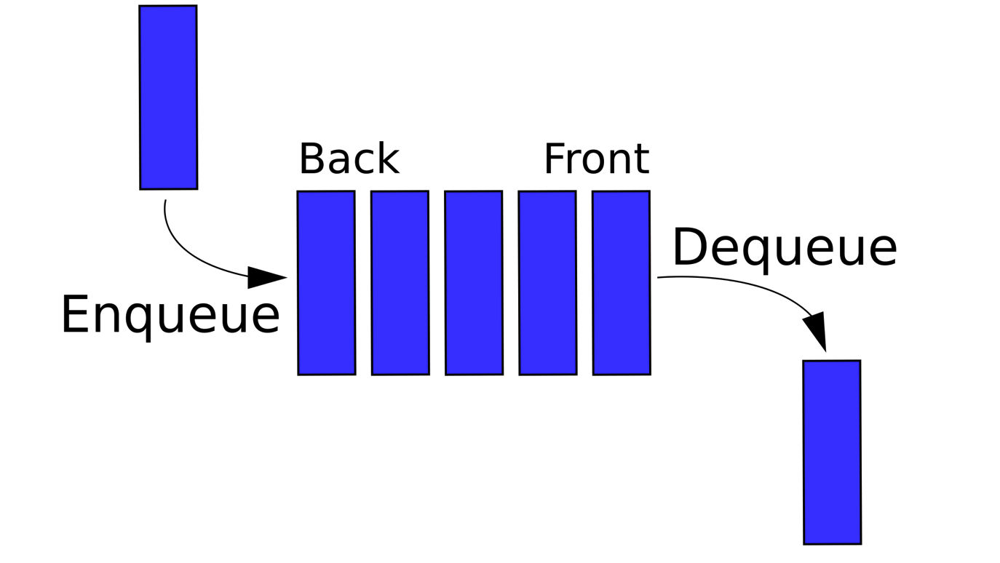
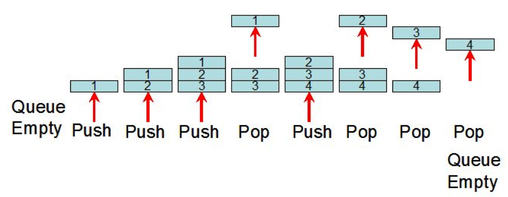

# Stacks Overview

* a stack is an **ordered collection** of items where the addition of new items and the removal of existing items always takes place at the same end
* This end is commonly referred to as the **"top"**
* The end opposite the top is known as the **"base"**
* The base of the stack is significant since items stored in the stack that are closer to the base represent that those have been in the stack longest
* The most recently added item is the one that is in position to be removed first
* **This ordering principle is sometimes called LIFO, last-in first-out**
* It provides an ordering based on length of time in the collection
* Newer items are near the top, while older items are near the base

* Note how the first items "pushed" to the stack begin at the base, and as item are items are "popped" out.
* Stacks are fundamentally important, as they can be used to **reverse the order of items**
* The order of insertion is the reverse of the order of removal

* Considering this reversal property, you can perhaps think of examples of stacks that occur as you use your computer.
* For example, every web browser has a Back button
* As you navigate from web page to web page, those pages are placed on a stack(actually it is the URLs that are going on the stack)
* The current page that you are viewing is on the top and the first page you looked at is at the base.
* If you click on the Back button, you begin to move in reverse order through the pages.

# Queue

* A Queue is an **ordered collection** of items where the addition of new items happens at one end, called the **"rear"**, and the removal of existing items occurs at the other end, commonly called the **"front"**
* As an element enters the Queue it starts at the rear and makes its way toward the front, waiting until that time when it is the next element to be removed
* The most recently added item in the queue must wait at the end of the collection
* The item that has been in the collection the longest is at the front
* **This ordering principle is sometimes called FIFO, first-in first-out**
* It is also known as "first-com first-served"
* The simplest example of a Queue is the typical line that we all participate in from time to time
* We wait in a line for a movie, we wait in the check-out line at a grocery store, and we wait in the cafeteria line
* The first person in that line is also the first person to get serviced/helped. So that's the parallel and why the naming schema is Q in this case

* Note how we have two terms here, Enqueue and Dequeue.
* The enqueue term describes when we add a new item to the rear of the queue.
* The dequeue term describes removing the front item from the queue.

# Deque Overview
* A deque, also known as a double-ended queue, is an ordered collection of items similar to the queue
* It has two ends, a front and a rear, and the items remain positioned in the collection
* What makes a deque different is the unrestrictive nature of adding and removing items
* New items can be added either the front or the rear
* Likewise, existing items can be removed from either end
* In a sense, this hybrid linear structure provides all the capabilities of stacks and queues in a single data structure
