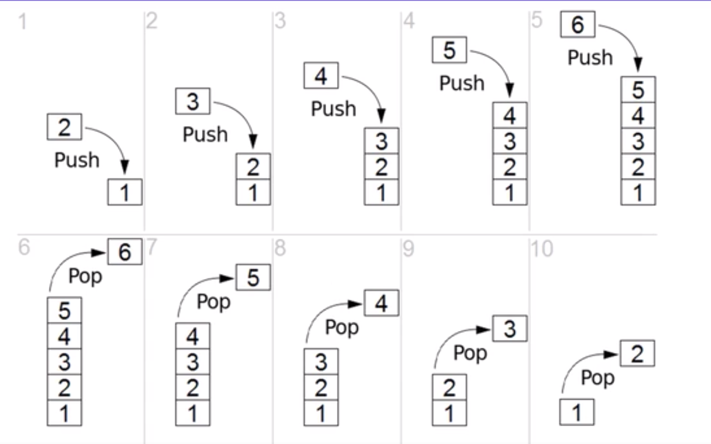

# Stacks Overview

* a stack is an **ordered collection** of items where the addition of new items and the removal of existing items always takes place at the same end
* This end is commonly referred to as the "top"
* The end opposite the top is known as the "base"
* The base of the stack is significant since items stored in the stack that are closer to the base represent that those have been in the stack longest
* The most recently added item is the one that is in position to be removed first
* **This ordering principle is sometimes called LIFO, last-in first-out**
* It provides an ordering based on length of time in the collection
* Newer items are near the top, while older items are near the base

* Note how the first items "pushed" to the stack begin at the base, and as item are items are "popped" out.
* Stacks are fundamentally important, as they can be used to **reverse the order of items**
* The order of insertion is the reverse of the order of removal

* Considering this reversal property, you can perhaps think of examples of stacks that occur as you use your computer.
* For example, every web browser has a Back button
* As you navigate from web page to web page, those pages are placed on a stack(actually it is the URLs that are going on the stack)
* The current page that you are viewing is on the top and the first page you looked at is at the base.
* If you click on the Back button, you begin to move in reverse order through the pages.
